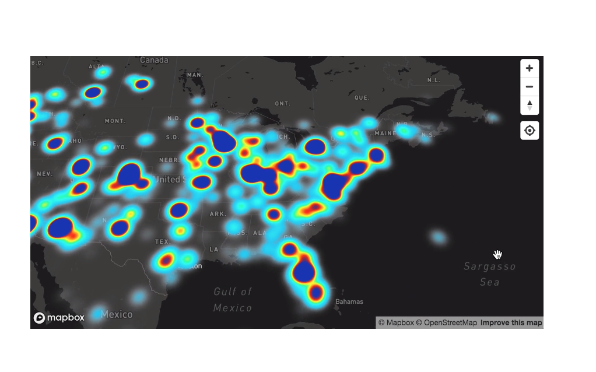
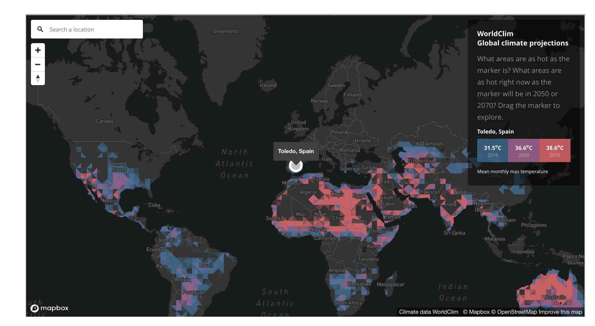
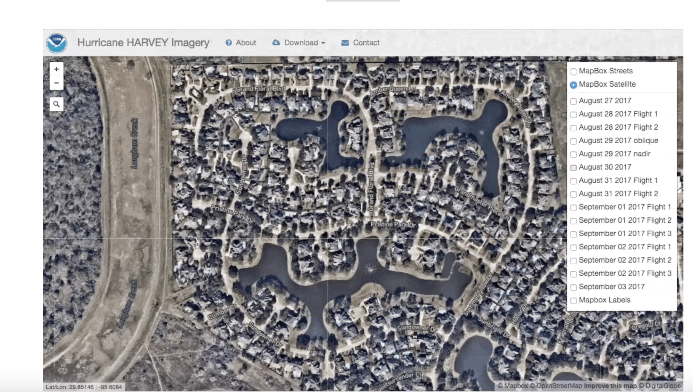
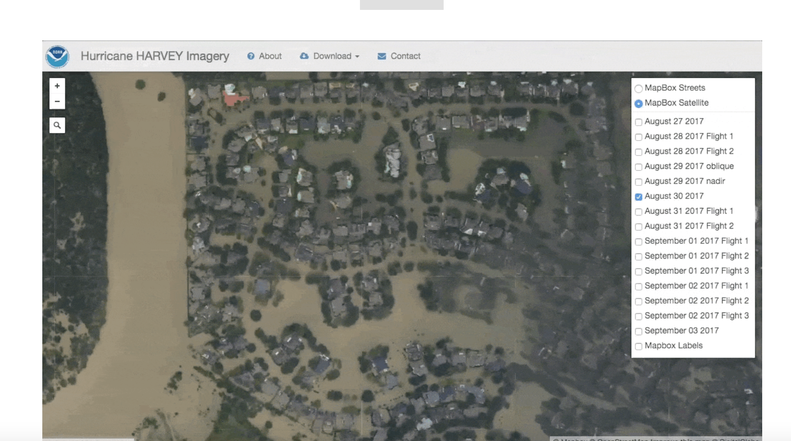

# Project 2 - Coral Reef Exploration

## Developer/Student Commentary:
This Repository has been made to summit the project assignment for our Data Science Bootcamp at Northwestern University

PROJECT 2

June, 2021

This project was created by:

* Jorge Daniel Atuesta [Github Profile](https://github.com/danielatuesta55)
* Jhon Cass [Github Profile](https://github.com/cass-john)
* Jhon Strode [Github Profile](https://github.com/jdstrode)

## Chosen topic Croal Reefs!

With drastic predictions that humans will demolish the seas floor by the year 2054, we decided to focus our attention on creating a visualization tool for users to see the changes of coral reefs in recent years worldwide. The idea behind this is to showcase the drastic impact that we are having on our ocean floors and at the same time create consciousness to the user of said problem.

Understanding that humans won’t call earth home if the ocean dies is crucial in this never-ending battle with global warming, recycling, and fishing! We hope that with this tool, the user can understand visually what’s happening to our reefs around the world. Now get ready to dive into the seas!

## Data sets
Here are the links to the data sets used for this project: 

Coral Reef Data set: [Click Here](https://www.kaggle.com/noaa/deep-sea-corals/download)

Global warming Data set: [Click Here](https://www.kaggle.com/berkeleyearth/climate-change-earth-surface-temperature-data)

Temperatures Data set: [Click Here](https://www.ncdc.noaa.gov/data-access/land-based-station-data/land-based-datasets/global-historical-climatology-network-ghcn) 

Temperatures Data set 2: [Click Here](https://www.ncei.noaa.gov/access/coastal-water-temperature-guide/all_tmap.html) 

NOAA Website: https://coralreefwatch.noaa.gov/crtr/data_resources.php

## Inspiration for our data visualizations

Here are some screen shots of diffrent maps that have a strong impact to visualize data.

1. 
2. 
3. 
4.    

